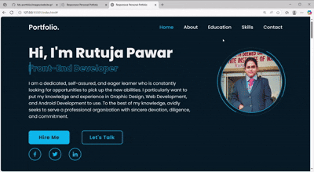

# 💼 Rutuja Shankar Pawar – Portfolio Website

Welcome to my personal portfolio website!  
This project showcases my skills, projects, and passion for web development.

---

## 🌐 Live Preview  
[🔗 View Website]https://rutujaapawar18.github.io/My-portfolio/ *(Hosted on GitHub Pages)*

---

## 🖼️ Website Preview  

---

## 🛠️ Built With

- **HTML5**
- **CSS3**
- **JavaScript**

---

## 📁 Project Structure

---

## 🚀 Features

- Responsive design  
- Smooth navigation  
- Contact form  
- Clean and modern UI  

---

## 👩‍💻 About Me

I'm **Rutuja Shankar Pawar**, an aspiring web developer passionate about designing and building clean, user-friendly websites. I enjoy learning new technologies and turning ideas into reality through code.

---

## 📫 Contact

📧 Email: [pawarrutuja917577@gmail.com](mailto:pawarrutuja917577@gmail.com)  
🔗 LinkedIn: [rutujapawar-rsp](https://www.linkedin.com/in/rutujapawar-rsp/)  
💻 GitHub: [RutujaaPawar18](https://github.com/RutujaaPawar18)

---

⭐ *Thank you for visiting my portfolio! Feel free to give feedback or suggestions.*
